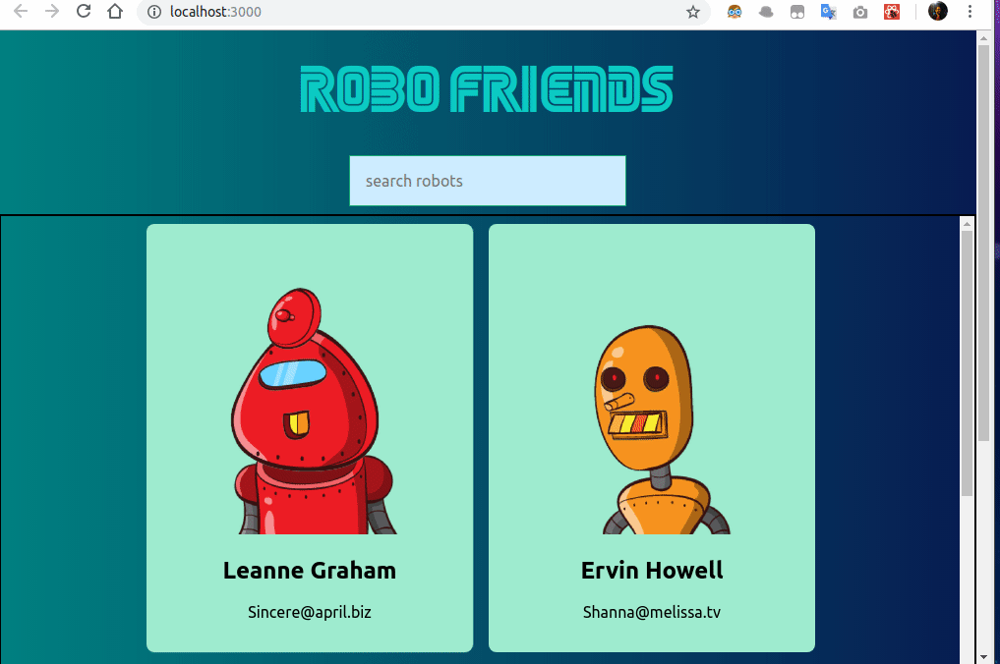

# reactRobots

A sample React application.



Install the dependencies and devDependencies and start the server.
```sh
$ git clone https://github.com/nuri-engin/reactRobots.git
$ cd reactRobots 
$ npm install
$ npm start
```
License
----
MIT
 
**Free Software!**